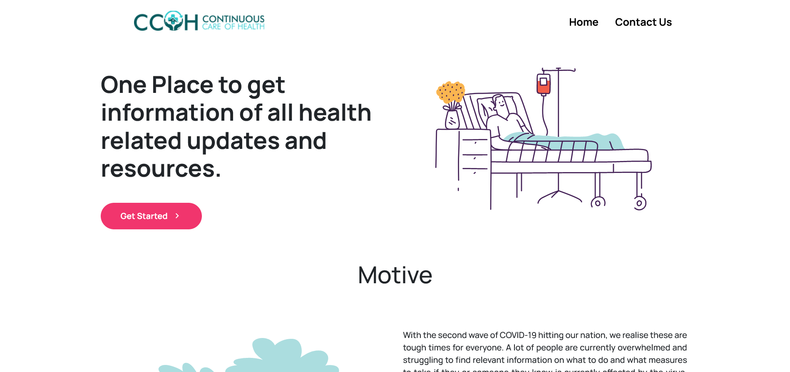
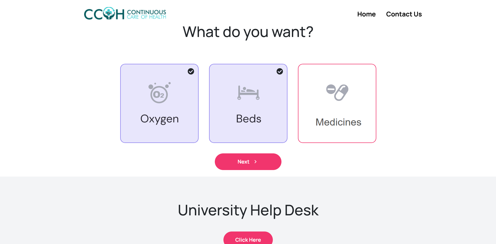
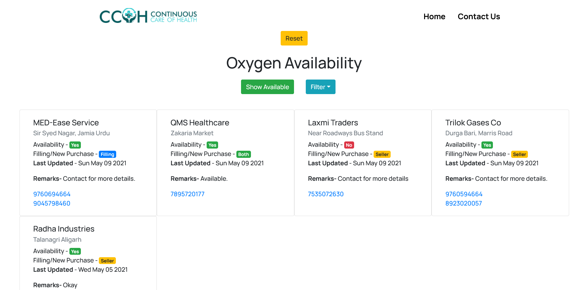

# AMU Continuous Care Of Health

This project was bootstrapped with [Create React App](https://github.com/facebook/create-react-app).

## Available Scripts

In the project directory, you can run:

### `yarn start`

Runs the app in the development mode.\
Open [http://localhost:3000](http://localhost:3000) to view it in the browser.

The page will reload if you make edits.\
You will also see any lint errors in the console.

## Data

Data is coming from api - https://amuccoh.pythonanywhere.com/api/v1/ which is made in Django Rest Framework which has endpoints `/oxygen`, `/hospitals` , `/meds`. We can add data from the admin panel - https://amuccoh.pythonanywhere.com

**You can find repository of API** - [AMU-CCOH-SERVER](https://github.com/farazkhanfk7/amu-ccoh-server)

# Screenshots

### You can visit the site [here](https://amuccoh.netlify.app)
